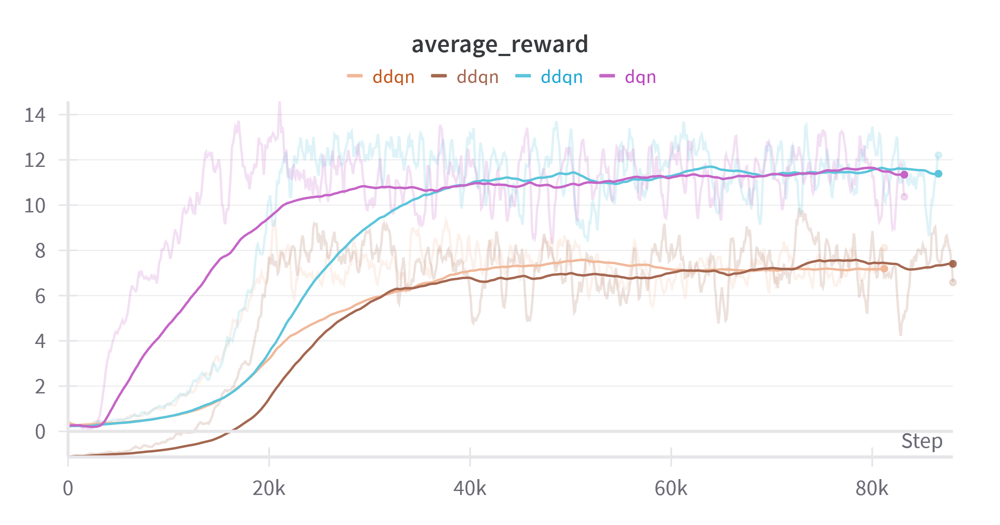

## Double DQN with Prioritized Experience Replay for Breakout

This project implements a Double Deep Q-Network (DDQN) with Prioritized Experience Replay to play the classic Atari game Breakout. The model was developed using PyTorch and includes several customizations and experimental configurations aimed at optimizing agent performance.
Project Structure

* agent_dqn.py: Main agent file implementing the Double DQN with prioritization and replay buffer.
* dqn_model.py: Model definitions for the Dueling DQN and standard DQN architectures.
* main.py: Entry point for training and testing the agent.
* README.md: Project overview and experiment descriptions.

# Project Setup
Requirements

    Python 3.8+
    PyTorch
    numpy
    OpenAI Gym (for Breakout environment)
    matplotlib (for plotting results)
    pandas (for saving reward and loss data)
    wandb (for experiment tracking, optional)

To run the training:

    python main.py --train

For testing:

    python main.py --test --model-path saved_model.pth

# Set of Experiments Performed
1. DQN Variants and Architectures

    * Dueling DQN: Implemented a Dueling DQN architecture with separate streams for estimating the state value and advantage function.
    * Standard DQN: Used as a baseline for comparison against the dueling variant.

2. Prioritized Experience Replay (PER)

Implemented prioritized experience replay, which prioritizes experiences with higher temporal difference (TD) errors, allowing the agent to focus on more "informative" experiences.
Priority Buffer Configuration

    Alpha: Controls the degree to which prioritization is applied. Experimented with values of 0.5, 0.6, and 0.7.
    Beta: Controls the importance-sampling correction. Beta was annealed from 0.4 to 1.0 during training.

3. Network Structure

We implemented and experimented with two architectures: Standard DQN and Dueling DQN.

1) Standard DQN:
   * Convolutional Layers: Three layers with 32, 64, and 64 filters, kernel sizes of 8, 4, and 3, and strides of 4, 2, and 1, respectively, each followed by ReLU.
   * Fully Connected Layers: A 512-neuron layer followed by ReLU, and an output layer for Q-values of each action.

2) Dueling DQN:
    * Feature Extraction: Same three convolutional layers as Standard DQN.
    * Value and Advantage Streams:
        * Each stream has a 512-neuron layer (with ReLU), and outputs the state value and action advantages, respectively.
    * Q-value Calculation: Combines state value and action advantages to produce final Q-values.

4. Hyperparameters
Hyperparameter
    * Learning Rate	0.0001, 0.001
    * Batch Size	32, 64
    * Gamma (Discount Factor)	0.99
    * Target Network Update Freq	100, 500, 1000, 5000 steps
    * Epsilon Decay Rate	0.99, 0.995
    * Epsilon Linear Decay Over 0.1, 0.2, 0.02,

6. Loss Function and Optimizer

    * Loss Function: Huber loss and SmoothL1Loss, selected for its robustness to outliers in the TD errors.
    * Optimizer: Adam optimizer with weight decay of 1e-4.

8. Activation Functions and Weight Initialization

    * Activation Functions: ReLU was used for all hidden layers.

# Results

* Average Reward

* Loss

* Total Reward

* Episode Length

The above screenshot shows the agent's average score over last 500 episdoes in the Breakout environment.
# Performance Summary

The best-performing model achieved an average reward of 382.96 after 42000 episodes. Prioritized experience replay improved convergence speed, and the Dueling DQN architecture provided a slight performance boost over the standard DQN.
Results Overview
| Experiment                  | Avg. Reward | Convergence Speed | Comments                  |
|-----------------------------|-------------|-------------------|---------------------------|
| Standard DQN                | 283         | Slow             | Baseline                  |
| Dueling DQN                 | 383         | Moderate         | Improved stability and rewads        |

# Conclusion

This project successfully implemented a Double DQN with Prioritized Experience Replay for the Breakout game. The experiments showed that prioritized replay significantly boosts performance by enabling the agent to focus on important experiences. Dueling DQN further improved performance, likely due to its enhanced capability of estimating state values and advantages.

# Future Work
* Hyperparameter Tuning: Fine-tuning additional hyperparameters such as alpha and beta decay.
* Experiment with Noisy Nets: Adding noise to the network for more stable exploration.
* Multi-step Returns: Incorporate multi-step returns to capture longer-term dependencies.
* Experiment with Rainbow DQN
